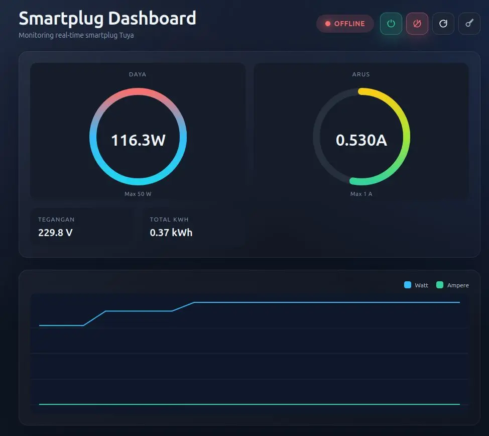

# Tuya Smartplug API

API sederhana untuk monitoring dan kontrol smartplug/IR blaster Tuya, lengkap
dengan dashboard real-time.



## Fitur

- Endpoint ON/OFF + status perangkat.
- Dashboard `/smartplug` dengan grafik watt/ampere dan refresh otomatis.
- Proteksi API key opsional via header `x-api-key`.

## Cepat Mulai

```bash
cp .env.example .env

deno task dev
# atau
# deno task start
```

## Dokumentasi

- Indeks dokumentasi: `docs/README.md`
- Konfigurasi env: `docs/CONFIG.md`
- API & contoh request: `docs/API.md`
- Dashboard & query params: `docs/DASHBOARD.md`

## Pengujian & Kualitas

```bash
deno task test

deno task lint

deno task format
```

## Struktur Direktori

- `src/` aplikasi utama (`server.ts`, `routes/`, `controllers/`, `services/`).
- `src/views/` template HTML/CSS/JS dashboard.
- `tests/` unit/integration test.
- `image/` aset statis.

## Catatan Keamanan

Jika `TUYA_API_KEY` diisi, semua endpoint `/api/*` wajib header `x-api-key`.
Dashboard bisa mengisi key via `?key=YOUR_KEY` sekali (disimpan di session).
